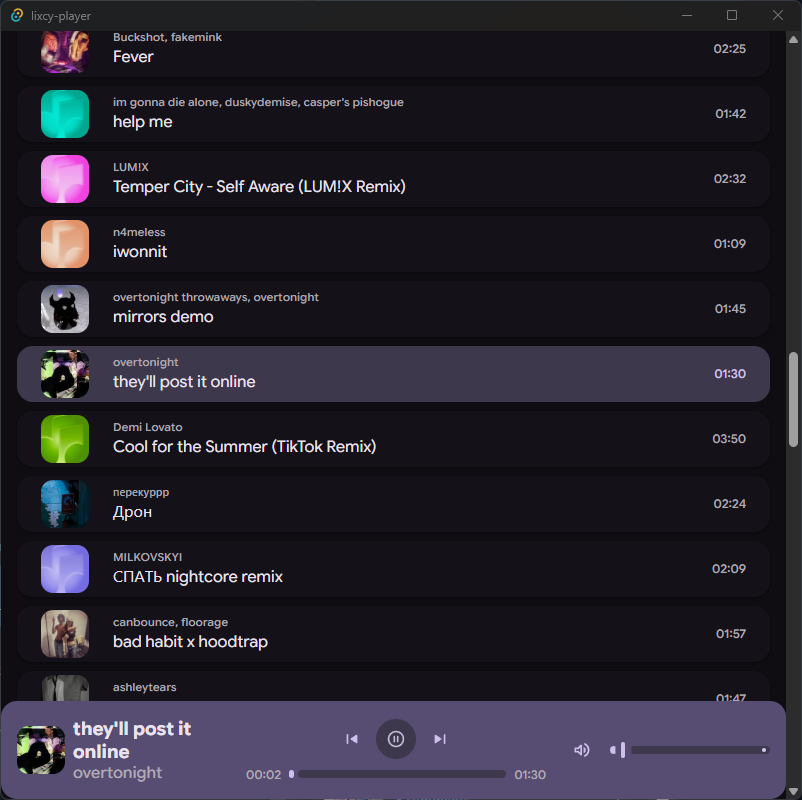
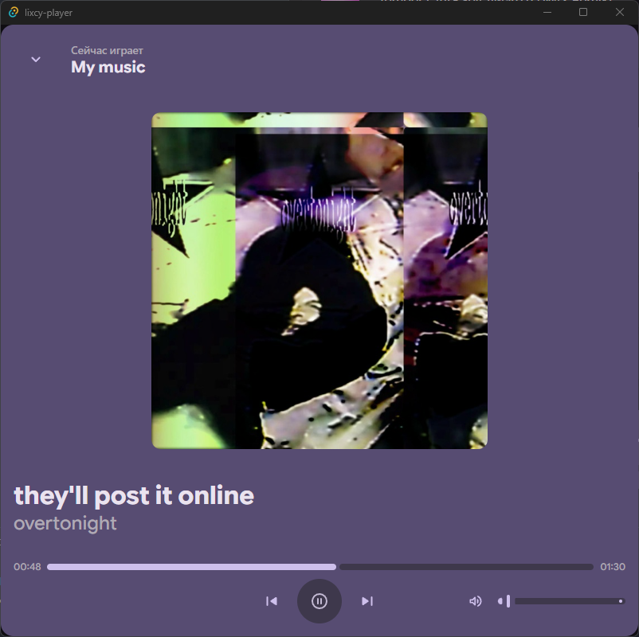
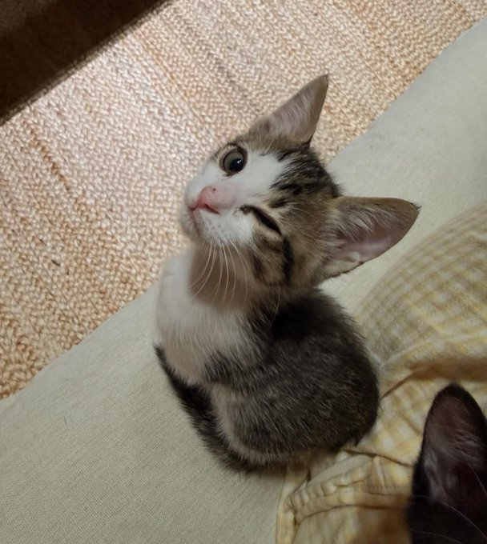

# Lixcy player



Micro player for music ~~from different sources~~ with Material You like design, [Maloja](https://github.com/krateng/maloja) scrobbles ~~and Discord RPC support~~. Have fun

Available sources:

- VK Music with **internal lixcy-relay** over [@toil/vk-audio](https://github.com/ilyhalight/vk-audio)

## Why?

I'm tired of constantly keeping an open tab with WebScrobbler, and i guess VK X for PC seems to be coming out in never :c

## Whats support?

Now, **lixcy player** supports:

- scrobble to [Maloja](https://github.com/krateng/maloja) instance (on 33% of track duration)
- auto change track to next
- play/pause track (wow!~)
- change track volume
- show track thumbnail
- change track to next/prev
- show track progress with seek support
- adaptation for different screen formats
- search audios
- set like/unlike audios



## Planned

- transitions between tracks like in Spotify
- Discord RPC
- Last.fm and Listenbrainz scrobbles support
- albums
- see tracks of other peoples
- search albums
- auto generated Mix playlist from sources (like VK Mix, For You and etc)
- other sources

## How to use?

> [!CAUTION]
> DON'T make it public available!!! Every visitor can access to your tracks!!!

0. Install Bun and Rust

1. Clone this repo with

```bash
git clone https://github.com/ilyhalight/lixcy-player
```

2. Install depends

```bash
bun i
```

3. Run dev server

includes desktop app:

```bash
bun dev:desktop
```

only as web app:

```bash
bun dev
```

## Conclusion

instead of conclusion see this

<details>
<summary>silly image</summary>



</details>
